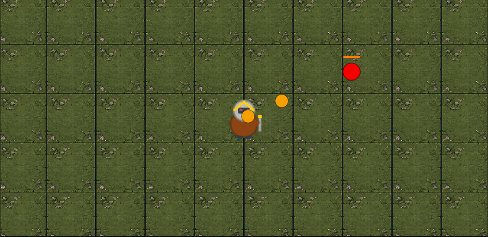

# survivor.unity

2D Survivor 遊戲 - Unity 專案



## MCP Unity Editor
https://github.com/CoderGamester/mcp-unity/blob/main/README_zh-CN.md

---

## 📁 專案目錄結構

### 根目錄

```
survivor.unity/
├── Assets/                  # Unity 資源目錄（核心遊戲資源）
├── docs/                    # 專案文檔目錄（非 Unity 資源）
├── Packages/                # Unity Package Manager 包
├── ProjectSettings/         # Unity 專案設定
├── Library/                 # Unity 編譯緩存（自動生成，不提交 Git）
├── Logs/                    # Unity 日誌（自動生成，不提交 Git）
├── Temp/                    # Unity 臨時文件（自動生成，不提交 Git）
├── UserSettings/            # Unity 用戶設定（自動生成）
├── .git/                    # Git 版本控制
├── PRD.md                   # 產品需求文檔
├── opencode.json            # OpenCode 配置
├── .mcp.json                # MCP Unity 配置
├── LICENSE                  # 開源許可證
├── .gitignore               # Git 忽略規則
└── README.md                # 專案說明文檔（本文件）
```

---

### Assets/ 目錄（Unity 資源）

**Unity 只處理 Assets/ 目錄下的文件，會自動為每個文件生成 `.meta` 文件（GUID 引用追踪）**

```
Assets/
├── Audio/                   # 音效資源（背景音樂、特效音）
├── Materials/               # 材質文件（Shader 配置）
├── ParticleSystems/         # 粒子特效預製件
├── Plugins/                 # 第三方插件
│   └ NuGet/                 # NuGet 包（MCP Unity 相關）
├── Prefabs/                 # 預製件
│   ├── EnemyPrefab.prefab   # 敵人預製件（scale=4x）
│   ├── ProjectilePrefab.prefab # 子彈預製件
│   └ FloorTile.prefab       # 地板 Tile 預製件
│   └ EnemySpawner.prefab    # 敵人生成器預製件
├── Scenes/                  # 場景文件
│   └ MainScene.unity        # 主遊戲場景
├── ScriptableObjects/       # ScriptableObject 配置文件
│   └ EnemyData.asset        # 敵人配置
│    WeaponData.asset        # 武器配置
├── Scripts/                 # C# 腳本目錄
│   ├── Components/          # 獨立組件腳本
│   ├── Config/              # 配置腳本
│   ├── Core/                # 核心遊戲邏輯
│   │   ├── PlayerController.cs  # 主角控制（移動、自動射擊）
│   │   ├── EnemyController.cs   # 敵人控制（追踪主角）
│   │   ├── SimpleEnemySpawner.cs # 敵人生成器
│   ├── Data/                # 數據結構定義
│   ├── Debug/               # 調試工具腳本
│   ├── Editor/              # Unity Editor 工具（菜單命令）
│   │   ├── CreateScriptableObjects.cs # 創建配置文件
│   │   ├── ScaleEnemyPrefab.cs       # 放大敵人 Prefab
│   │   ├── SetupPlayerShooting.cs    # 配置主角射擊
│   ├── Effects/             # 特效腳本
│   ├── Systems/             # 遊戲系統
│   ├── UI/                  # UI 腳本
│   ├── Utils/               # 工具類腳本
│   ├── SetupPuzzleFloor.cs  # 地板初始化腳本
├── SpriteAtlases/           # Sprite 圖集
├── Sprites/                 # 2D 圖片素材
│   ├── floor_tileset.png    # 地板素材（10x5 網格）
│   ├── player_character.png # 主角 sprite
├── UI Toolkit/              # UI Toolkit 资源
```

---

### docs/ 目錄（專案文檔）

**文檔目錄不在 Assets/ 下，Unity 不會處理，不需要 `.meta` 文件**

```
docs/
├── EditorTools/             # Editor 工具說明文檔
│   ├── README.md            # 工具集總覽
│   ├── README_CreateScriptableObjects.md # 創建配置文件說明
│   ├── README_ScaleEnemyPrefab.md         # 放大敵人說明
│   ├── README_SetupPlayerShooting.md      # 配置射擊說明
└── superpowers/             # Superpowers 技能文檔
```

---

## 🎯 重要文件說明

### Unity Editor 工具（Assets/Scripts/Editor/）

**必需工具（保留）**：
- ✅ `CreateScriptableObjects.cs` - 創建敵人/武器配置文件
- ✅ `ScaleEnemyPrefab.cs` - 批量放大敵人 Prefab 到 4x
- ✅ `SetupPlayerShooting.cs` - 配置主角自動射擊功能

**已刪除工具（暫時性）**：
- ❌ `SetupEnemySpawner.cs` - 敵人生成器已手動配置
- ❌ `SetupProjectilePrefab.cs` - 子彈已手動配置
- ❌ `SetupEnemyPrefab.cs` - 敵人已手動配置
- ❌ `BatchSetupEnemyPrefabs.cs` - 批量配置已完成
- ❌ `FixEnemyPrefabColliders.cs` - Collider 已修復
- ❌ `EnemyPrefabScalingTool.cs` - 敵人已放大
- ❌ `EnemyPrefabUtility.cs` - 重複功能

**使用方式**：
```
Unity Editor 單：
Survivor → Create Scriptable Objects
Survivor → Scale All Enemy Prefabs 4x
Survivor → Setup Player Shooting
```

---

### 核心腳本（Assets/Scripts/Core/）

- `PlayerController.cs` - 主角控制：
  - 移動控制（WASD/方向鍵）
  - 自動射擊（每 0.5 秒）
  - 不旋轉、不受重力

- `EnemyController.cs` - 敵人控制：
  - 向主角移動
  - 碰撞检测

- `SimpleEnemySpawner.cs` - 敵人生成器：
  - 每 2 秒生成一個敵人
  - 最多 50 個敵人
  - 在主角周圍 8 units 處生成

---

## ⚠️ .meta 文件系統

### Unity .meta 文件的作用

**Unity 為 Assets/ 目錄下的所有文件自動生成 `.meta` 文件**：
- 提供唯一的 GUID（全局唯一标识符）
- 追踪資源引用關係
- 存儲導入設定
- 版本控制一致性

**適用對象**：
- ✅ `.cs` 腳本文件（必需，其他腳本會引用）
- ✅ `.png` 图片文件（必需，Prefab/场景会引用）
- ✅ `.prefab` 預製件（必需，场景会引用）
- ✅ `.unity` 場景文件（必需）
- ❌ `.md` 文檔文件（無用，不会被引用）

**最佳實踐**：
- ✅ Assets/ 目录下的文件保留 `.meta`（提交到 Git）
- ✅ docs/ 目录下的文件不需要 `.meta`（不提交 `.meta`）
- ✅ 项目根目录的 `.md` 文件不需要 `.meta`

---

## 🚀 快速開始

### 1. Editor 工具配置（首次運行）

```
Unity Editor 菜單：
1. Survivor → Create Scriptable Objects（創建配置文件）
2. Survivor → Scale All Enemy Prefabs 4x（放大敵人）
3. Survivor → Setup Player Shooting（配置射擊）
```

### 2. Play Mode 測試

```
Ctrl + P（進入 Play Mode）
測試：
- WASD 移動主角
- 敵人自動生成並追踪主角
- 主角自動射擊
```

### 3. Git 提交

```
git add Assets/
git add docs/
git commit -m "feat(core): 完成核心遊戲功能配置"
git push
```

---

## 📋 專案狀態

**已完成**：
- ✅ PuzzleFloor 地板系統（50 tiles）
- ✅ Player 主角控制（移動、不旋轉、不受重力）
- ✅ Player 自動射擊功能
- ✅ Enemy 敵人生成系統（SimpleEnemySpawner）
- ✅ Enemy 敵人追踪主角（EnemyController）
- ✅ Editor 工具整理（保留 3 個必需工具）
- ✅ 文檔整理（移至 docs/ 目录）

**待測試**：
- ⏳ Play Mode 測試（Ctrl + P）
- ⏳ 敵人生成與追踪
- ⏳ 主角自動射擊

---

## 🛠️ 技術栈

- **Unity 版本**: 2022.3 或更高
- **渲染管线**: URP (Universal Render Pipeline)
- **腳本語言**: C# (.NET Standard 2.1)
- **AI 助手**: OpenCode + MCP Unity
- **版本控制**: Git

---

## 📖 相關文檔

- [PRD.md](PRD.md) - 產品需求文檔
- [docs/EditorTools/README.md](docs/EditorTools/README.md) - Editor 工具說明
- [MCP Unity 文檔](https://github.com/CoderGamester/mcp-unity/blob/main/README_zh-CN.md)

