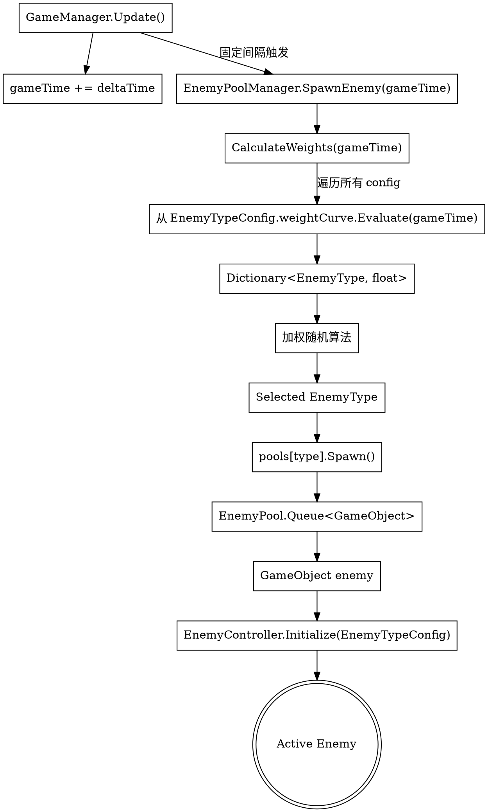

# Phase 2.1: Enemy Types Design Specification

**日期**: 2026-05-06  
**版本**: 1.0  
**状态**: 设计完成，待实作  
**作者**: AI Game Developer

---

## 🎯 Goal

实作 Unity 2D 倖存者游戏 Phase 2.1: Enemy Types（普通型、快速型、坦克型、远程型敌人），包含：
- 4 种敌人类型独立 Prefab
- ScriptableObject 配置系统（权重曲线、属性配置）
- 多类型 Object Pool Manager
- 远程敌人射击机制

---

## 📋 Constraints & Preferences

### 技术约束
- **Unity MCP 工具**: 必须使用 ai-game-developer_* 工具操作 Unity Editor
- **Object Pooling**: PRD 规定必须实作 Pooling 系统
- **MVP 简化**: 固定间隔敌人生成（完整 Wave System 等 Phase 2.4）
- **美术**: 简单形状标识（后期补 Pixel Art）
- **Input System**: 使用旧 Input Manager（Input System Package 工具不可用）

### 设计决策
- **Prefab 实作策略**: 4 个独立 Prefabs（易于配置、清晰分离）
- **权重系统**: ScriptableObject + AnimationCurve（可扩展、可视化配置）
- **Pool Manager**: 从单类型 EnemyPool 重构为多类型 EnemyPoolManager

---

## 📊 PRD 规格（参考）

| EnemyType | 外观 | 血量 | 速度(px/s) | 伤害 | 经验值 | 出现时间 |
|-----------|------|------|-----------|------|-------|---------|
| Normal    | 红色圆形，白色眼睛+生气表情 | 1 | 50-70 | 10 | 10 | 游戏开始 |
| Fast      | 绿色圆形，体型较小，头顶三角尖角 | 1 | 90-110 | 8 | 12 | 30秒后权重增加 |
| Tank      | 灰色大型，红色眼睛+大嘴，外层光环 | 3 | 25-45 | 20 | 25 | 60秒后权重增加（头顶显示血量条） |
| Ranged    | 紫色圆形，黄色眼睛+弧形嘴，头顶圆形标记 | 2 | 30-50 | 10 | 15 | 45秒后开始出现（每2秒发射紫色子弹，伤害5） |

---

## 🏗️ Section 1: Architecture Overview

### System Layers

```
┌─────────────────────────────────────────┐
│  Game Time (GameManager.GameTime)       │  ← 动态权重计算输入
└─────────────────┬───────────────────────┘
                  │
                  ▼
┌─────────────────────────────────────────┐
│  EnemyTypeConfig (ScriptableObject)     │  ← 权重曲线配置
│  - NormalEnemyConfig                    │
│  - FastEnemyConfig                      │
│  - TankEnemyConfig                      │
│  - RangedEnemyConfig                    │
└─────────────────┬───────────────────────┘
                  │
                  ▼
┌─────────────────────────────────────────┐
│  EnemyPoolManager (MonoBehaviour)       │  ← 多类型 Pool 管理器
│  - Dict<EnemyType, EnemyPool>           │
│  - SpawnEnemy(gameTime) → SelectType    │
└─────────────────┬───────────────────────┘
                  │
                  ▼
┌─────────────────────────────────────────┐
│  EnemyPool (MonoBehaviour)              │  ← 单类型 Pool（保留）
│  - Queue<GameObject> pool               │
│  - Spawn() / Return()                   │
└─────────────────┬───────────────────────┘
                  │
                  ▼
┌─────────────────────────────────────────┐
│  EnemyController (MonoBehaviour)        │  ← 敌人实例控制
│  - EnemyType enum                       │
│  - Type-specific stats (speed, hp, etc.)│
└─────────────────────────────────────────┘
```

### Key Design Principles

1. **Separation of Concerns**
   - `EnemyTypeConfig`: 纯数据配置（权重曲线、基础属性）
   - `EnemyPoolManager`: 统筹管理（权重计算、类型选择）
   - `EnemyPool`: 单类型 Pool 操作（Spawn/Return）
   - `EnemyController`: 实例行为控制

2. **Data-Driven Design**
   - 所有敌人属性通过 ScriptableObject 配置
   - 权重曲线使用 Unity AnimationCurve（可视化编辑）
   - 新增敌人类型无需修改代码

3. **Extensibility**
   - `EnemyType` enum 作为类型标识
   - 每个类型独立 Prefab + Config + Pool
   - 未来新增类型只需添加：Enum 选项 + Config asset + Prefab

---

## 📦 Section 2: ScriptableObject Config Design

### Class 1: EnemyTypeConfig（单类型配置）

```csharp
public enum EnemyType
{
    Normal,   // 普通型
    Fast,     // 快速型
    Tank,     // 坦克型
    Ranged    // 远程型
}

[CreateAssetMenu(fileName = "EnemyTypeConfig", menuName = "Survivor/EnemyTypeConfig")]
public class EnemyTypeConfig : ScriptableObject
{
    [Header("Enemy Identity")]
    public EnemyType enemyType;
    
    [Header("Base Stats")]
    public float moveSpeed;          // 移动速度（px/秒，需转换为 Unity units）
    public int maxHealth;            // 最大生命值
    public int expValue;             // 死亡时掉落经验值
    
    [Header("Spawn Weight")]
    public AnimationCurve weightCurve;  // 游戏时间(秒) → 权重(0-1)
    public float minSpawnTime;          // 最小出现时间（秒）
    
    [Header("Type-specific Stats")]
    // Ranged 类型专用
    public float attackRange;        // 射击距离（Unity units）
    public float attackInterval;     // 射击间隔（秒）
    public GameObject projectilePrefab; // 射击 Projectile Prefab
    
    [Header("Visual")]
    public Color enemyColor;         // 简单形状颜色（后期替换为 Sprite）
}
```

**AnimationCurve 示例配置：**

| EnemyType | weightCurve 特性 | minSpawnTime |
|-----------|------------------|--------------|
| Normal    | 常数曲线（始终 0.6） | 0 秒 |
| Fast      | 30秒后从 0 上升到 0.3 | 30 秒 |
| Tank      | 60秒后从 0 上升到 0.2 | 60 秒 |
| Ranged    | 45秒后从 0 上升到 0.25 | 45 秒 |

---

### Class 2: EnemySpawnSettings（全局生成设置）

```csharp
[CreateAssetMenu(fileName = "EnemySpawnSettings", menuName = "Survivor/EnemySpawnSettings")]
public class EnemySpawnSettings : ScriptableObject
{
    [Header("Spawn Control")]
    public float spawnInterval;      // 固定生成间隔（秒）
    public int maxActiveEnemies;     // 场上最大敌人数量
    
    [Header("Enemy Type Configs")]
    public List<EnemyTypeConfig> enemyConfigs;  // 所有类型配置列表
    
    [Header("Pool Settings")]
    public int initialPoolSize;      // 每个类型 Pool 初始大小
}
```

**配置文件结构：**

```
Assets/Configs/
├── EnemySpawnSettings.asset         ← 全局设置
└── EnemyTypes/
    ├── NormalEnemyConfig.asset      ← 普通型配置
    ├── FastEnemyConfig.asset        ← 快速型配置
    ├── TankEnemyConfig.asset        ← 坦克型配置
    └── RangedEnemyConfig.asset      ← 远程型配置
```

---

## 🎨 Section 3: Prefab Structure & Pool Integration

### Prefab Structure（4 个独立 Prefabs）

```
Assets/Prefabs/
├── EnemyPrefab.prefab               ← 基础型（已存在，复用）
├── FastEnemyPrefab.prefab           ← 快速型（新建）
├── TankEnemyPrefab.prefab           ← 坦克型（新建）
├── RangedEnemyPrefab.prefab         ← 远程型（新建）
└── ProjectilePrefab.prefab          ← 已存在（复用）
```

**每个 Prefab 结构：**

```
FastEnemyPrefab.prefab
├─ GameObject: FastEnemy
   ├─ SpriteRenderer (Color: Green)
   ├─ Rigidbody2D (Dynamic, gravity=0)
   ├─ CircleCollider2D (radius=0.3)  ← 体型较小
   └─ EnemyController (Script)
      ├─ enemyType: Fast
      ├─ moveSpeed: 110
      ├─ maxHealth: 1
      ├─ expValue: 12
      └─ ...

TankEnemyPrefab.prefab
├─ GameObject: TankEnemy
   ├─ SpriteRenderer (Color: Gray)
   ├─ Rigidbody2D (Dynamic, gravity=0)
   ├─ CircleCollider2D (radius=0.8)  ← 体型较大
   ├─ EnemyController (Script)
      ├─ enemyType: Tank
      ├─ moveSpeed: 45
      ├─ maxHealth: 3
      ├─ expValue: 25
      └─ ...
   └─ HealthBarUI (GameObject, optional)  ← 头顶血量条（Phase 2.1 MVP 可暂不实作）

RangedEnemyPrefab.prefab
├─ GameObject: RangedEnemy
   ├─ SpriteRenderer (Color: Purple)
   ├─ Rigidbody2D (Dynamic, gravity=0)
   ├─ CircleCollider2D (radius=0.5)
   ├─ EnemyController (Script)
      ├─ enemyType: Ranged
      ├─ moveSpeed: 50
      ├─ maxHealth: 2
      ├─ expValue: 15
      ├─ attackRange: 8.0
      ├─ attackInterval: 2.0
      └─ projectilePrefab: ProjectilePrefab
   └─ EnemyAutoFire (Script, new component)
      ├─ attackRange: 8.0
      ├─ attackInterval: 2.0
      └─ projectilePrefab: ProjectilePrefab
```

---

### Pool Integration（重构 EnemyPool → EnemyPoolManager）

**Phase 1 现有结构（需要重构）：**

```csharp
// Assets/Scripts/Systems/EnemyPool.cs（单类型 Pool）
public class EnemyPool : MonoBehaviour
{
    public GameObject enemyPrefab;
    public int initialPoolSize;
    private Queue<GameObject> pool;
    
    public GameObject Spawn(Vector3 position);
    public void Return(GameObject enemy);
}
```

**Phase 2.1 新结构（多类型 Pool Manager）：**

```csharp
// Assets/Scripts/Systems/EnemyPoolManager.cs（新建）
public class EnemyPoolManager : MonoBehaviour
{
    [Header("Spawn Settings")]
    public EnemySpawnSettings spawnSettings;
    
    [Header("Enemy Prefabs")]
    public GameObject normalPrefab;
    public GameObject fastPrefab;
    public GameObject tankPrefab;
    public GameObject rangedPrefab;
    
    private Dictionary<EnemyType, EnemyPool> pools;
    private List<EnemyTypeConfig> configs;
    
    private void Initialize()
    {
        pools = new Dictionary<EnemyType, EnemyPool>();
        configs = spawnSettings.enemyConfigs;
        
        // 为每个类型创建独立 Pool
        foreach (var config in configs)
        {
            var pool = CreatePoolForType(config.enemyType);
            pools.Add(config.enemyType, pool);
        }
    }
    
    public GameObject SpawnEnemy(float gameTime)
    {
        // 1. 根据 gameTime 计算权重
        var weights = CalculateWeights(gameTime);
        
        // 2. 加权随机选择类型
        var selectedType = SelectEnemyType(weights);
        
        // 3. 从对应 Pool 中 Spawn
        var pool = pools[selectedType];
        return pool.Spawn(GetRandomSpawnPosition());
    }
    
    private Dictionary<EnemyType, float> CalculateWeights(float gameTime);
    private EnemyType SelectEnemyType(Dictionary<EnemyType, float> weights);
    private EnemyPool CreatePoolForType(EnemyType type);
}
```

**EnemyPool 保留并微调：**

```csharp
// Assets/Scripts/Systems/EnemyPool.cs（修改）
public class EnemyPool : MonoBehaviour
{
    public GameObject enemyPrefab;        // 由 EnemyPoolManager 动态赋值
    public EnemyType enemyType;           // 新增：类型标识
    public int initialPoolSize;
    private Queue<GameObject> pool;
    
    public GameObject Spawn(Vector3 position);
    public void Return(GameObject enemy);
}
```

---

## 🔧 Section 4: EnemyController Changes & Ranged Enemy Behavior

### EnemyController Modifications

**Phase 1 现有代码（需要修改）：**

```csharp
// Assets/Scripts/Core/EnemyController.cs
public class EnemyController : MonoBehaviour
{
    private Rigidbody2D rb;
    private Transform playerTransform;
    private float moveSpeed = 2.0f;    // ← 硬编码速度
    private int currentHealth = 50;    // ← 硬编码生命值
    
    private void Update()
    {
        // 追踪玩家
        Vector2 direction = (playerTransform.position - transform.position).normalized;
        rb.velocity = direction * moveSpeed;
    }
}
```

**Phase 2.1 修改（读取 Config）：**

```csharp
// Assets/Scripts/Core/EnemyController.cs（修改）
public class EnemyController : MonoBehaviour
{
    [Header("Type Identity")]
    public EnemyType enemyType;        // 新增：类型标识
    
    private EnemyTypeConfig config;    // 新增：从 EnemyPoolManager 获取
    private Rigidbody2D rb;
    private Transform playerTransform;
    private int currentHealth;
    
    public void Initialize(EnemyTypeConfig config)
    {
        this.config = config;
        enemyType = config.enemyType;
        currentHealth = config.maxHealth;
        
        // 应用类型特定属性
        ApplyTypeSpecificSettings();
    }
    
    private void ApplyTypeSpecificSettings()
    {
        // Tank 类型：更大的碰撞体
        if (enemyType == EnemyType.Tank)
        {
            GetComponent<CircleCollider2D>().radius = 0.8f;
        }
        
        // Ranged 类型：启用 EnemyAutoFire component
        if (enemyType == EnemyType.Ranged)
        {
            var autoFire = GetComponent<EnemyAutoFire>();
            if (autoFire != null)
            {
                autoFire.Initialize(config.attackRange, config.attackInterval, config.projectilePrefab);
            }
        }
    }
    
    private void Update()
    {
        // Normal/Fast/Tank：追踪玩家
        if (enemyType != EnemyType.Ranged)
        {
            Vector2 direction = (playerTransform.position - transform.position).normalized;
            rb.velocity = direction * config.moveSpeed;
        }
        else
        {
            // Ranged：保持距离（若距离 < attackRange，停止移动）
            float distance = Vector2.Distance(transform.position, playerTransform.position);
            if (distance > config.attackRange)
            {
                Vector2 direction = (playerTransform.position - transform.position).normalized;
                rb.velocity = direction * config.moveSpeed;
            }
            else
            {
                rb.velocity = Vector2.zero;  // 停止移动，开始射击
            }
        }
    }
    
    public void TakeDamage(int damage)
    {
        currentHealth -= damage;
        if (currentHealth <= 0)
        {
            Die();
        }
    }
    
    private void Die()
    {
        // 掉落经验球
        ExperienceOrb.SpawnExpOrb(transform.position, config.expValue);
        
        // 返回 Pool
        EnemyPoolManager.Instance.ReturnEnemy(gameObject);
    }
}
```

---

### New Component: EnemyAutoFire（Ranged Enemy 射击逻辑）

```csharp
// Assets/Scripts/Core/EnemyAutoFire.cs（新建）
public class EnemyAutoFire : MonoBehaviour
{
    private float attackRange;
    private float attackInterval;
    private GameObject projectilePrefab;
    private Transform playerTransform;
    private float lastAttackTime;
    
    public void Initialize(float range, float interval, GameObject prefab)
    {
        attackRange = range;
        attackInterval = interval;
        projectilePrefab = prefab;
        playerTransform = GameObject.FindGameObjectWithTag("Player").transform;
    }
    
    private void Update()
    {
        float distance = Vector2.Distance(transform.position, playerTransform.position);
        
        // 仅在攻击范围内射击
        if (distance <= attackRange && Time.time - lastAttackTime >= attackInterval)
        {
            FireProjectile();
            lastAttackTime = Time.time;
        }
    }
    
    private void FireProjectile()
    {
        // 计算射击方向（朝向玩家）
        Vector2 direction = (playerTransform.position - transform.position).normalized;
        
        // 从 ProjectilePool 获取 Projectile（复用 Phase 1 系统）
        var projectile = ProjectilePool.Instance.Spawn(transform.position);
        
        // 设置 Projectile 方向
        var projectileController = projectile.GetComponent<ProjectileController>();
        projectileController.SetDirection(direction);
    }
}
```

---

### Type-Specific Behaviors Summary

| EnemyType | 移动行为 | 特殊行为 | 视觉标识 |
|-----------|---------|---------|---------|
| **Normal** | 持续追踪玩家 | 无 | Red Circle |
| **Fast** | 持续追踪玩家（速度 ×2） | 体型较小（radius=0.3） | Green Circle |
| **Tank** | 持续追踪玩家（速度 ×0.5） | 更大碰撞体（radius=0.8） | Gray Circle |
| **Ranged** | 保持攻击距离 | 自动射击（每2秒） | Purple Circle |

---

## 🔄 Section 5: GameManager 整合与资料流

### GameManager Update Loop 修改

**Phase 1 现有代码（需要修改）：**

```csharp
// Assets/Scripts/Core/GameManager.cs（Phase 1 Update Loop）
private void Update()
{
    // 固定间隔生成敌人
    if (Time.time >= nextSpawnTime && activeEnemies < maxEnemies)
    {
        enemyPool.Spawn(GetRandomSpawnPosition());
        nextSpawnTime = Time.time + spawnInterval;
        activeEnemies++;
    }
}
```

**Phase 2.1 修改（整合 EnemyPoolManager）：**

```csharp
// Assets/Scripts/Core/GameManager.cs（Phase 2.1 Update Loop）
private EnemyPoolManager enemyPoolManager;  // 替换原 enemyPool

private void Update()
{
    // 固定间隔生成敌人（根据 gameTime 动态选择类型）
    if (Time.time >= nextSpawnTime && activeEnemies < maxEnemies)
    {
        enemyPoolManager.SpawnEnemy(gameTime);  // ← 传入 gameTime
        nextSpawnTime = Time.time + spawnInterval;
        activeEnemies++;
    }
    
    // 更新游戏时间
    gameTime += Time.deltaTime;
}
```

---

### 资料流图



---

## 📊 Section 6: 加权随机算法

### 算法实现

```csharp
// Assets/Scripts/Systems/EnemyPoolManager.cs
private EnemyType SelectEnemyType(Dictionary<EnemyType, float> weights)
{
    // 1. 计算总权重
    float totalWeight = 0f;
    foreach (var weight in weights.Values)
    {
        totalWeight += weight;
    }
    
    // 2. 生成随机值（0 到 totalWeight）
    float randomValue = Random.Range(0f, totalWeight);
    
    // 3. 加权随机选择
    float cumulativeWeight = 0f;
    foreach (var kvp in weights)
    {
        cumulativeWeight += kvp.Value;
        if (randomValue <= cumulativeWeight)
        {
            return kvp.Key;
        }
    }
    
    // 4. 默认返回 Normal
    return EnemyType.Normal;
}
```

### 权重计算示例（ gameTime = 45秒）

假设 AnimationCurve 配置如下：

| EnemyType | weightCurve.Evaluate(45) | 计算权重 |
|-----------|-------------------------|---------|
| Normal    | 0.6                     | 0.6     |
| Fast      | 0.25                    | 0.25    |
| Tank      | 0.0                     | 0.0     |
| Ranged    | 0.15                    | 0.15    |

总权重 = 0.6 + 0.25 + 0 + 0.15 = 1.0

随机值 = 0.7 → 选择 **Fast**（cumulativeWeight 超过 0.85 时）

---

## 🧪 Section 7: 测试策略

### Unit Tests（EditMode Tests）

**测试 1：权重计算正确性**

```csharp
// Assets/Tests/EditMode/EnemyPoolManagerTests.cs
[Test]
public void CalculateWeights_AtGameTime30_ReturnsCorrectWeights()
{
    var manager = new EnemyPoolManager();
    manager.InitializeWithMockConfigs();
    
    var weights = manager.CalculateWeights(30f);
    
    Assert.AreEqual(0.6f, weights[EnemyType.Normal]);
    Assert.AreEqual(0.2f, weights[EnemyType.Fast]);
    Assert.AreEqual(0.0f, weights[EnemyType.Tank]);
    Assert.AreEqual(0.0f, weights[EnemyType.Ranged]);
}
```

**测试 2：加权随机算法**

```csharp
[Test]
public void SelectEnemyType_WithWeights_ReturnsCorrectDistribution()
{
    var manager = new EnemyPoolManager();
    var weights = new Dictionary<EnemyType, float>
    {
        { EnemyType.Normal, 0.6f },
        { EnemyType.Fast, 0.3f },
        { EnemyType.Tank, 0.1f }
    };
    
    // 运行 1000 次测试
    Dictionary<EnemyType, int> counts = new Dictionary<EnemyType, int>();
    for (int i = 0; i < 1000; i++)
    {
        var type = manager.SelectEnemyType(weights);
        counts[type] = counts.ContainsKey(type) ? counts[type] + 1 : 1;
    }
    
    // 检查分布接近权重比例（±10%误差）
    Assert.IsTrue(counts[EnemyType.Normal] > 500);  // 约 60%
    Assert.IsTrue(counts[EnemyType.Fast] > 250);    // 约 30%
    Assert.IsTrue(counts[EnemyType.Tank] > 50);     // 约 10%
}
```

---

### Integration Tests（PlayMode Tests）

**测试 3：敌人生成完整流程**

```csharp
// Assets/Tests/PlayMode/EnemySpawnIntegrationTests.cs
[Test]
public void SpawnEnemy_AtGameTime45_SpawnsRangedEnemy()
{
    // 1. 加载 MainScene
    SceneManager.LoadScene("MainScene");
    
    // 2. 获取 GameManager
    var gameManager = GameObject.Find("GameManager").GetComponent<GameManager>();
    
    // 3. 设置 gameTime = 45
    gameManager.SetGameTime(45f);
    
    // 4. 触发生成
    gameManager.SpawnEnemyNow();
    
    // 5. 检查生成的敌人类型
    var enemies = GameObject.FindGameObjectsWithTag("Enemy");
    Assert.IsTrue(enemies.Length > 0);
    
    var controller = enemies[0].GetComponent<EnemyController>();
    Assert.AreEqual(EnemyType.Ranged, controller.enemyType);
}
```

---

## 📝 Section 8: Implementation Notes

### Unity 单位转换

PRD 速度单位为 **px/秒**，需转换为 Unity units：

```
Unity units = px / pixelsPerUnit

假设 Camera.orthographicSize = 5，屏幕高度 = 10 units = 1080 px
pixelsPerUnit = 108

Normal 速度: 50-70 px/s → 0.46-0.65 units/s
Fast 速度: 90-110 px/s → 0.83-1.02 units/s
Tank 速度: 25-45 px/s → 0.23-0.42 units/s
Ranged 速度: 30-50 px/s → 0.28-0.46 units/s
```

---

### AnimationCurve 配置建议

**Normal Enemy:**
```
Keyframe 0: time=0, value=0.6
Keyframe 1: time=120, value=0.4  ← 后期权重降低
```

**Fast Enemy:**
```
Keyframe 0: time=0, value=0
Keyframe 1: time=30, value=0.3
Keyframe 2: time=60, value=0.35
Keyframe 3: time=120, value=0.4
```

**Tank Enemy:**
```
Keyframe 0: time=0, value=0
Keyframe 1: time=60, value=0.2
Keyframe 2: time=120, value=0.25
```

**Ranged Enemy:**
```
Keyframe 0: time=0, value=0
Keyframe 1: time=45, value=0.15
Keyframe 2: time=90, value=0.2
```

---

### MVP 简化（Phase 2.1 范围）

**本次实作包含：**
- ✅ 4 种敌人类型 Prefab（简单形状）
- ✅ ScriptableObject 配置系统
- ✅ 多类型 Pool Manager
- ✅ 远程敌人射击机制
- ✅ 权重曲线配置

**暂不实作（后续 Phase）：**
- ❌ Tank 头顶血量条 UI（Phase 2.1 后续微调）
- ❌ Pixel Art 美术替换（Phase 3）
- ❌ 连杀机制（Phase 2.2）
- ❌ Wave System（Phase 2.4）

---

## 📁 File Structure（新建文件）

```
Assets/
├── Scripts/
│   ├── Core/
│   │   ├── EnemyController.cs（修改）
│   │   └─ EnemyAutoFire.cs（新建）
│   └── Systems/
│       ├── EnemyPool.cs（修改）
│       └── EnemyPoolManager.cs（新建）
│   └── Config/
│       ├── EnemyTypeConfig.cs（新建）
│       └── EnemySpawnSettings.cs（新建）
├── Configs/
│   ├── EnemySpawnSettings.asset（新建）
│   └── EnemyTypes/
│       ├── NormalEnemyConfig.asset（新建）
│       ├── FastEnemyConfig.asset（新建）
│       ├── TankEnemyConfig.asset（新建）
│       └── RangedEnemyConfig.asset（新建）
└── Prefabs/
    ├── FastEnemyPrefab.prefab（新建）
    ├── TankEnemyPrefab.prefab（新建）
    └── RangedEnemyPrefab.prefab（新建）
```

---

## 🔗 Dependencies

**依赖 Phase 1 系统：**
- `ProjectilePool.cs`（Ranged Enemy 射击复用）
- `ProjectileController.cs`（Projectile 方向设置）
- `ExperienceOrb.cs`（敌人死亡掉落经验球）
- `GameManager.cs`（gameTime 计算与敌人生成触发）

---

## 🎯 Success Criteria

1. **功能完整性**
   - ✅ 4 种敌人类型正确生成
   - ✅ 权重曲线动态调整生效
   - ✅ 远程敌人正确射击
   - ✅ Object Pooling 正常运作

2. **数据驱动**
   - ✅ 所有属性通过 ScriptableObject 配置
   - ✅ AnimationCurve 可视化编辑生效

3. **扩展性**
   - ✅ 新增敌人类型无需修改核心代码
   - ✅ Prefab/Config 清晰分离

4. **测试覆盖**
   - ✅ 权重计算单元测试通过
   - ✅ 加权随机算法分布正确
   - ✅ 敌人生成集成测试通过

---

## 📌 Next Steps

1. ✅ 设计规格完成（本文档）
2. ⏭️ 编写实作计划（invoke writing-plans skill）
3. ⏭️ 实作 Phase 2.1 代码
4. ⏭️ 创建 Prefabs 与 Config assets
5. ⏭️ 配置 GameManager 整合
6. ⏭️ 测试验证
7. ⏭️ Git commit（遵循 conventional commit 格式）

---

**文档版本历史：**
- v1.0 (2026-05-06): 初版设计完成